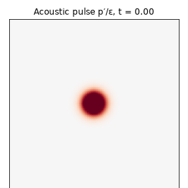
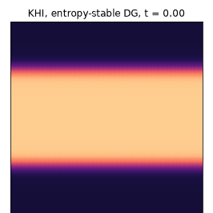
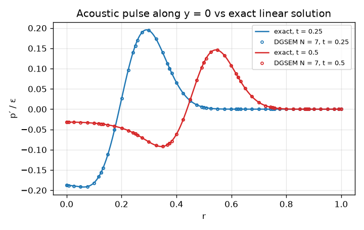
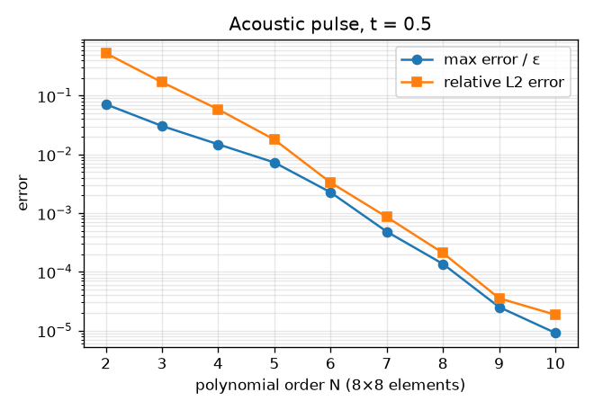
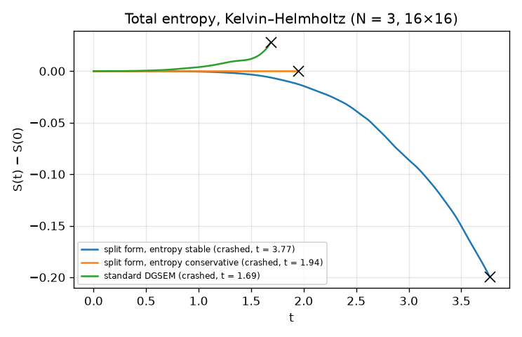
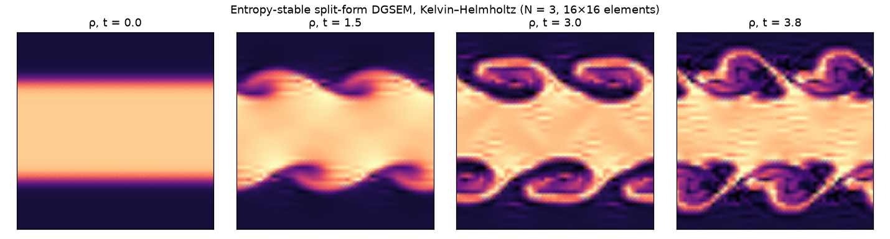

# Entropy-Stable Split-Form DGSEM for the Euler Equations

[](https://github.com/cfdgasman/dgsem-entropy-stable/actions/workflows/ci.yml)

A 2D **discontinuous Galerkin spectral element method** for the compressible Euler equations in **split form**, built on **summation-by-parts (SBP)** operators and **flux differencing**. It is **entropy conservative** in the volume and **entropy stable** with dissipative interface fluxes. It is verified on Tam's **acoustic pulse** benchmark against the exact linear solution and stress-tested on an under-resolved **Kelvin–Helmholtz** instability.

<p align="center">

&nbsp;

</p>

## Equations

$$ \partial_t\mathbf u + \partial_x\mathbf f(\mathbf u) + \partial_y\mathbf g(\mathbf u) = 0,\qquad \mathbf u = (\rho,\rho u,\rho v,E),\qquad p=(\gamma-1)\big(E-\tfrac12\rho|\mathbf v|^2\big). $$

The mathematical entropy S = −ρs/(γ−1), with s = ln(pρ<sup>−γ</sup>), is convex. Its entropy variables are **w** = ∂S/∂**u** = ((γ − s)/(γ−1) − ρ|**v**|²/2p, ρu/p, ρv/p, −ρ/p). Smooth solutions conserve ∫S; shocks can only decrease it. The goal is a discretisation that reproduces this at the discrete level.

## Discretisation

### 1. SBP operators on LGL nodes

On the reference element [−1, 1]², the solution is a tensor-product Lagrange polynomial of degree N on **Legendre–Gauss–Lobatto** nodes, and integrals use LGL quadrature (collocation). The differentiation matrix D and the diagonal mass matrix M = diag(w) satisfy the **SBP property**

$$ Q + Q^{\mathsf T} = B = \mathrm{diag}(-1,0,\dots,0,1),\qquad Q = MD, $$

the discrete form of integration by parts. The code checks this to round-off for all N in the tests.

### 2. Flux differencing (split form)

For one direction on an element of width h, the semi-discretisation at node i is

$$ \frac{d\mathbf u_i}{dt} = -\frac{2}{h}\Big[\,\underbrace{2\sum_{k=0}^{N} D_{ik}\,\mathbf f^{\#}(\mathbf u_i,\mathbf u_k)}_{\text{volume}} \;+\; \frac{\delta_{iN}}{w_N}\big(\mathbf f^{*}_{R}-\mathbf f(\mathbf u_N)\big) \;-\; \frac{\delta_{i0}}{w_0}\big(\mathbf f^{*}_{L}-\mathbf f(\mathbf u_0)\big)\Big], $$

and likewise in y. The two-point **volume flux** f<sup>#</sup> determines the split form:
- **f<sup>#</sup> = {f} = ½(f<sub>i</sub> + f<sub>k</sub>)** recovers the **standard DGSEM**. Because the rows of D sum to zero, 2Σ<sub>k</sub>D<sub>ik</sub>{f}<sub>ik</sub> = (Df)<sub>i</sub>; a test checks this identity.
- **f<sup>#</sup> = entropy-conserving flux** (Tadmor's condition ⟦**w**⟧·f<sup>#</sup> = ⟦ψ⟧, with entropy potential ψ = ρu). Combined with SBP, the volume terms then telescope into boundary terms: **no entropy is produced inside an element**.

The code uses **Ranocha's (2018)** flux, which is both entropy conserving and kinetic-energy preserving:

$$ f^{\rho} = \rho^{\ln}\{u\},\quad f^{\rho u} = f^{\rho}\{u\} + \{p\},\quad f^{\rho v} = f^{\rho}\{v\},\quad f^{E} = f^{\rho}\Big(\tfrac12 u_Lu_R + \tfrac12 v_Lv_R + \frac{1}{(\gamma-1)(\rho/p)^{\ln}}\Big) + \tfrac12(p_Lu_R+p_Ru_L). $$

Here a<sup>ln</sup> is the **logarithmic mean**, evaluated stably with the Ismail–Roe series. One implementation detail matters: the series cutoff must be ξ < 10⁻⁴. With the often-quoted 10⁻² cutoff, Tadmor's condition holds only to 10⁻¹⁰, and entropy conservation visibly fails.

### 3. Interface fluxes

| | f\* | total entropy (semi-discrete) |
|---|---|---|
| EC | f<sup>#</sup>(u<sub>L</sub>, u<sub>R</sub>) | conserved, dS/dt = 0 to round-off |
| **ES** | f<sup>#</sup> − ½ λ<sub>max</sub> (u<sub>R</sub> − u<sub>L</sub>) (Rusanov) | dS/dt ≤ 0 |

### 4. Time integration

The code uses **SSP-RK3** (Shu–Osher). The time step comes from the **smallest LGL node spacing**, Δt = CFL / Σ<sub>d</sub>(λ<sub>d</sub>/Δx<sub>min,d</sub>) with CFL = 0.4. This scales like 1/N². A first version scaled like 1/N and went unstable for N ≥ 7, which is a nice illustration of why DG time steps shrink quickly with polynomial order.

## Results

### Semi-discrete entropy budgets

| Scheme | dS/dt on a rough state |
|---|---|
| split form + EC interface | **−1×10⁻¹⁵** (round-off) |
| split form + ES interface | strictly negative |
| standard DGSEM | **+3.6×10⁻⁸** (entropy *production*: no stability guarantee) |

### Acoustic pulse (Tam 1995), exact linear solution

A Gaussian pressure pulse of amplitude ε = 10⁻⁵ and half-width 0.1 in a gas at rest (c = 1). For small ε the exact solution is the Hankel-transform integral

$$ p'(r,t) = \frac{\varepsilon}{2\alpha}\int_0^\infty e^{-\xi^2/4\alpha}\cos(\xi t)\,J_0(\xi r)\,\xi\,d\xi,\qquad \alpha = \frac{\ln 2}{b^2}. $$

<p align="center"></p>

| N | points / direction | max error / ε | relative L2 error | entropy change |
|---|---|---|---|---|
| 2 | 24 | 7.1e-02 | 5.3e-01 | −3e-13 |
| 4 | 40 | 1.5e-02 | 5.9e-02 | −5e-14 |
| 6 | 56 | 2.3e-03 | 3.3e-03 | −2e-14 |
| 8 | 72 | 1.4e-04 | 2.1e-04 | −3e-14 |
| 10 | 88 | 9.1e-06 | 1.9e-05 | −4e-14 |

The error converges **spectrally** in N, with 8 × 8 elements, until it reaches the O(ε) = 10⁻⁵ difference between the nonlinear Euler equations and linear acoustics. On this smooth problem the entropy-stable scheme dissipates essentially nothing.

<p align="center"></p>

### Kelvin–Helmholtz instability: robustness

The shear layer uses ρ = ½ + ¾B, u = ½(B − 1), v = 0.1 sin 2πx, p = 1, with B = tanh(15y + 7.5) − tanh(15y − 7.5). It runs with N = 3 on 16 × 16 elements, a deliberately **under-resolved** grid.

| Scheme | outcome |
|---|---|
| standard DGSEM | crashed at t = 1.69, with entropy growing before the crash |
| split form, entropy conservative | crashed at t = 1.94 (no dissipation at all) |
| **split form, entropy stable** | **ran to t = 3.77**, then lost positivity |

<p align="center"></p>
<p align="center"></p>

**Interpretation.** Entropy stability removes the nonlinear instability mechanism that kills the standard scheme: aliasing-driven entropy growth. The ES scheme survives more than twice as long and develops the roll-ups cleanly. Entropy stability does **not** guarantee positive density and pressure, though, and on this coarse mesh the ES scheme eventually fails too. That agrees with the literature (Rueda-Ramírez & Gassner 2021). Production codes add a positivity-preserving limiter or subcell shock capturing on top.

## Usage

```bash
pip install -r requirements.txt
python run.py     # tables, figures and GIFs in docs/ (~10 min)
pytest            # SBP, log mean, Tadmor condition, entropy budgets, free stream, DGSEM equivalence
```

## References

G. J. Gassner, A. R. Winters, D. A. Kopriva, *Split form nodal discontinuous Galerkin schemes with summation-by-parts property for the compressible Euler equations*, J. Comput. Phys. 327 (2016) 39–66.
H. Ranocha, *Comparison of some entropy conservative numerical fluxes for the Euler equations*, J. Sci. Comput. 76 (2018) 216–242.
E. Tadmor, *Entropy stability theory for difference approximations of nonlinear conservation laws*, Acta Numerica 12 (2003) 451–512.
C. K. W. Tam, *Benchmark problems and solutions*, ICASE/LaRC Workshop on Benchmark Problems in CAA, NASA CP-3300 (1995).
A. M. Rueda-Ramírez, G. J. Gassner, *A subcell finite volume positivity-preserving limiter for DGSEM discretizations of the Euler equations*, WCCM-ECCOMAS (2021).

## License

MIT
